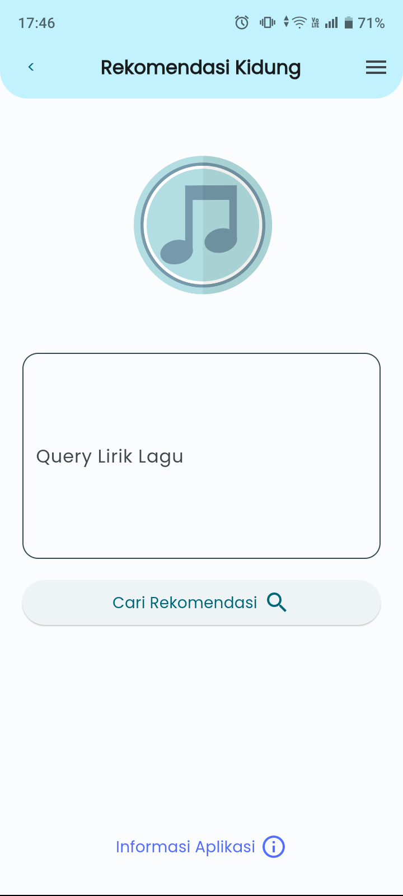
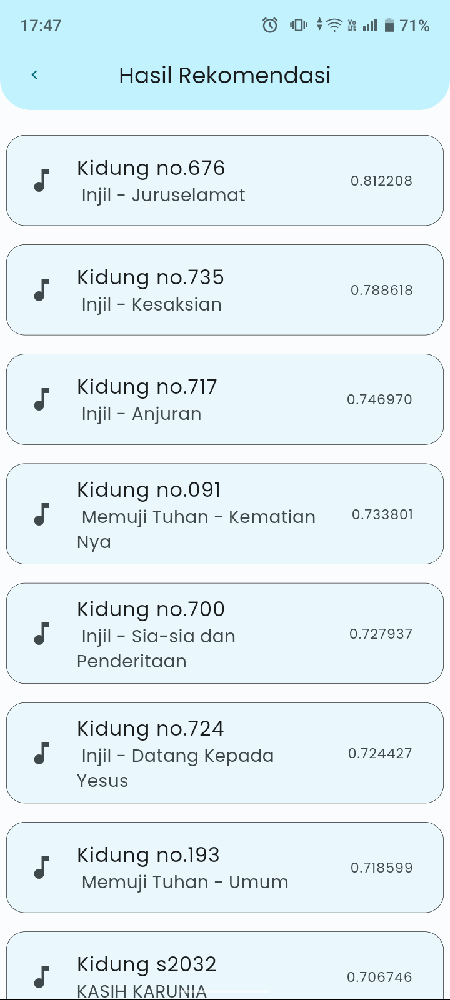
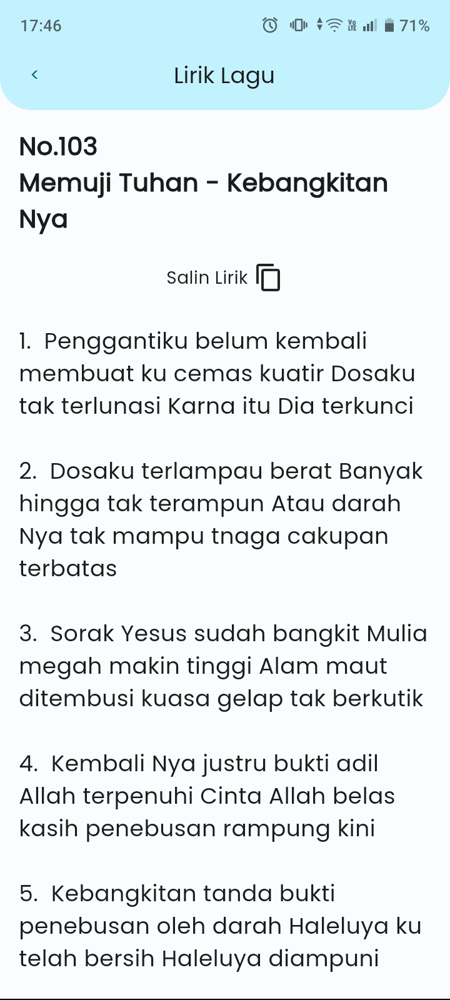
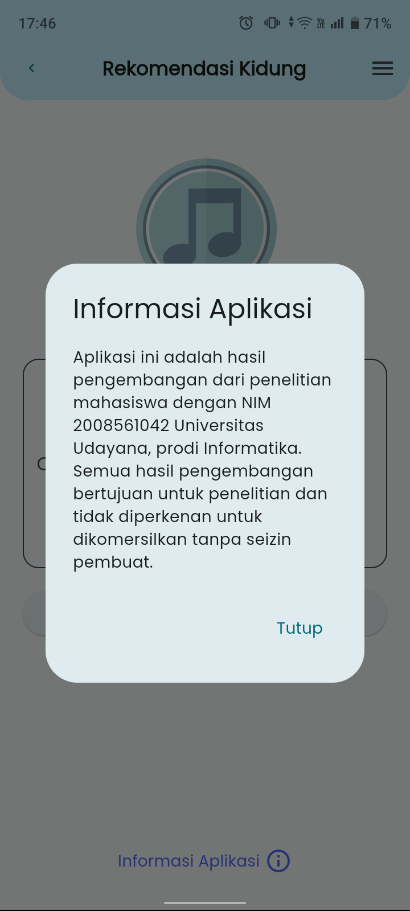

## Sistem Rekomendasi Lagu Pujian Kristen Berbasisi Content-based Filtering dengan Triangle Area Similarity - Sector Area Similarity (TS-SS)

### Abstrak

    Lagu merupakan salah satu sarana untuk mencurahkan isi hati dan perasaan melalui kata-kata dalam lirik. Lagu pujian kristen adalah salah satu lagu yang banyak mengandung kata yang mendalam dan bermakna yang mewakili perasaan umat kristiani untuk diungkapkan kepada Tuhan. Pertimbangan untuk menentukan lagu pujian dalam suatu ibadah bukanlah suatu perkara yang mudah. Banyak faktor yang harus diperhatikan, salah satunya adalah kesesuaian antara lagu dengan tema ibadah. Permasalahan yang terdapat di Gereja Sidang Jemaat Kristus (GSJK) adalah tidak adanya alat bantu yang mempermudah pencarian lagu berdasarkan lirik yang sesuai dengan tema ibadah. Dengan jumlah lagu yang tersebar sebanyak 1000 lebih membuat pencarian sangat sulit. Permasalahan tersebut bisa diselesaikan dengan sistem rekomendasi berbasis content-based filtering. Rekomendasi berbasis content-based filtering menggunakan kemiripan konten untuk mendapatkan rekomendasi yang sesuai. Pada penelitian ini, metode similarity yang digunakan untuk menghitung kemiripan konten adalah Triangle Area Similarity-Sector Area Similarity (TS-SS). Data lagu yang digunakan berjumlah 1150 yang didapatkan dari situs kidung GSJK. Konten yang digunakan untuk mencari kemiripan konten adalah judul, kategori, dan lirik lagu. Hasil pengujian melibatkan 3 responden yaitu 2 pendeta dan 1 jemaat. Hasil rekomendasi dari sistem dibandingkan dengan hasil rekomendasi dari responden yang kemudian dihitung nilai precision, recall, dan f-score. Hasilnya rata-rata gabungan dari ketiga responden didapatkan rata-rata precision 78%, rata-rata recall 78,51%, dan rata-rata f1-score 77,53%.

- Manual Book : [Link Manual book PDF](https://drive.google.com/file/d/1HMP87ZERXl4bOBYY2FNAW4_GAsBE2naQ/view?usp=sharing)
- Article : [Link Publication PDF](https://drive.google.com/file/d/1PwpWmN8-jcV8fNfawQj59yGVntK15RI1/view?usp=sharing)

### Screenshot Android APP

| Home Page                | Hasil Rekomendasi        |
|--------------------------|--------------------------|
|  |  |

| Lirik Lagu Pujian        | Info Aplikasi            |
|--------------------------|--------------------------|
|  |  |